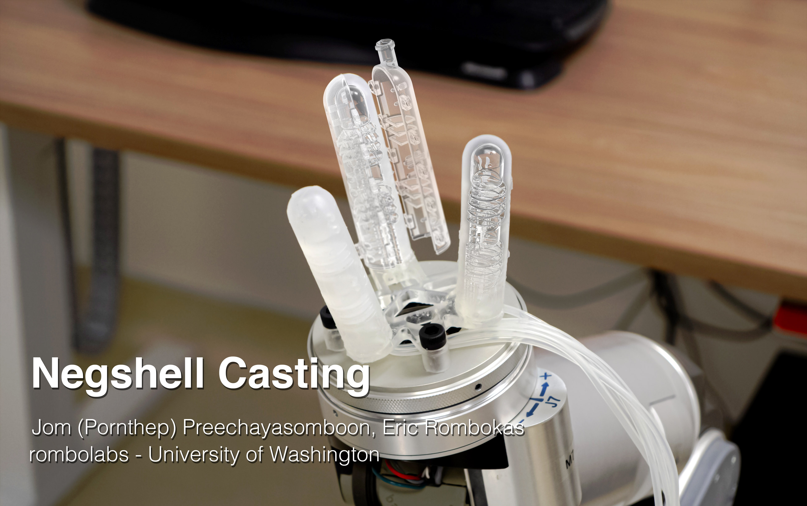

Hi folks!

This page is a comprehensive guide to Negshell Casting to accompany the paper: [**Negshell casting: 3D-printed structured and sacrificial cores for soft robot fabrication**](//collections.plos.org/s/soft-robotics). Negshell casting is a fabrication method for making lightweight and strong soft robots. It eliminates the steps for intermediate core removal or multi-step casting for silicone or urethane based soft robots, soft haptic actuators or soft medical devices.

### Contact

Questions beyond the documentation? Please submit an [Issue](//github.com/prnthp/negshell/issues) on the repository or contact me directly at [prnthp@uw.edu](mailto:prnthp@uw.edu).

### Paper Authors
- Jom Preechayasomboon - [prnthp.github.io](//prnthp.github.io)
- Eric Rombokas - [rombolabs.github.io](//rombolabs.github.io)
