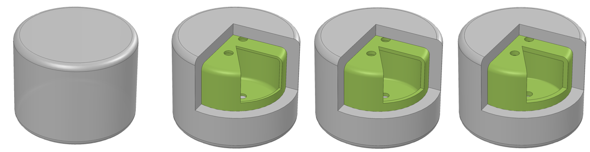
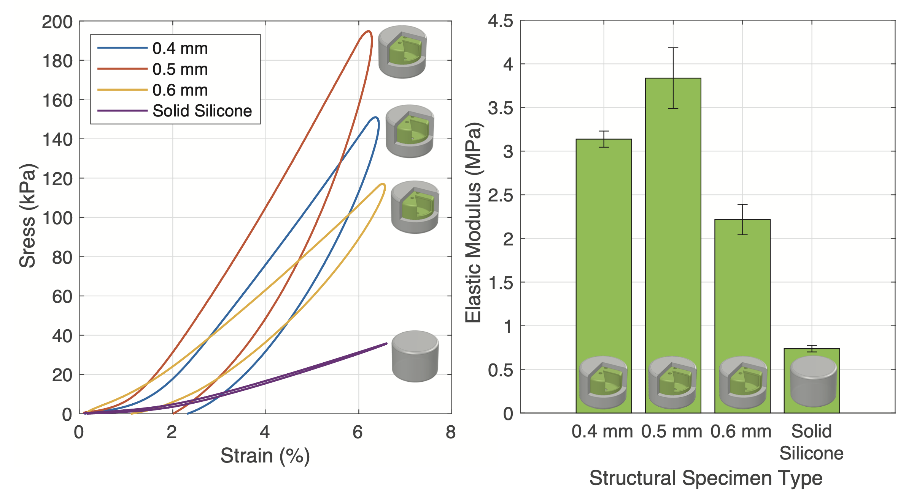

# Structural Cores
{: .no_toc }

Structural cores, unlike negshell cores, are not meant to be crushed or broken. Structural cores serve two purposes: 1. To modulate the local stiffness of soft robotic structures. 2. To reduce the overall weight of the soft robot. Structural cores are simply thin-walled geometry that serves as voids inside the soft robot.

For example, we use several structural cores to help transmit the force from the fingertip to the mounting base in our [Finger](example-finger) example. Another example is using structural cores to create rigid endoskeleton for larger structures that would otherwise droop or collapse if made purely from silicone, such as wings.

## Table of contents
{: .no_toc .text-delta }

1. TOC
{:toc}

## Characteristics
Structural cores will increase the stiffness (Elastic Modulus) of the silicone part up to over 500% and depending on the thickness and orientation of the structural core and weight down to 67% depending on the geometry. The following plot shows the different stress-strain curves achieved with various thicknesses of the structural cores.

## Designing
Creating structural cores in CAD is similar to the workflow for negshell cores. The only difference is there is no perforation.

(*SW* denotes steps that are for SolidWorks, however all the following steps can be adapted to other software.)

1. Starting with a solid geometry of the desired core, create a thin surface that is thickened towards the inside of the core. The thickness can vary between 0.4 mm to 0.6 mm depending on the use case. Please see the above characteristics for rough guidance.
    1. *SW* - It is advisable to add fillets so the core has tangent continuity across the whole surface.
    1. *SW* - Use the **Surface Offset** command and set the **Offset to 0 mm** to create a copy of the surface.
    1. *SW* - Use the **Thicken** command to thicken the surface by **0.4 mm to 0.6 mm** *inwards* (right most button of the three options). Make sure to **untick Merge Result**. Then hide the original solid body. *This thickness can be tweaked and tuned for different printers or materials.*
1. Add mounting features to the core. The core cannot simply hover in place in the mold without any support. All the cores used in our paper and this website have 1.5 mm holes that a 1.5 mm column from the mold would slide into to suspend the cores in place.
    1. *SW* - Use the **Cut-Extrude** command to cut the 1.5 mm holes.
1. Export the files for printing.
    1. *SW* - Hide all the bodies except for the structural cores and go to **File → Save As...** and select the .STL format or best format for your SLA/DLP printer.

Again, more advanced users of SolidWorks should design the cores and molds together in a single part with multiple bodies so design changes can propagate throughout the mold and cores at once.

For examples of using a negshell cores in oft robotic designs, see the Finger and Gripper examples.

## Printing
3D printing the structural cores has the same process as the negshell cores. We used Formlabs Clear V4 resin.

1. Import the .STL for the cores. Generally, Preform will use the Autodesk Netfabb cloud service to repair any broken models. If this occurs, double check the model for inconsistencies.
1. Orient the part so that there are minimal support structures.
1. Generate the supports with the following parameters: **Density: 0.6**, **Touchpoint Size: 0.4 mm**, **Raft: On**.
    1. Using a raft will help with support removal, as it is easier to hold the part in one hand and trim supports with the other.
1. Print the part(s). The mounting holes will provide an escape for resin that is trapped during the printing process.
1. After printing, remove the parts using the raft and trim away the supports carefully. Use a paper towel doused in 95% or higher IPA to wipe the cores clean. Unlike negshell cores, structural cores can withstand brief submersion into an IPA bath if needed.
1. Structural core parts tend to hold more residual resin than negshell cores. Simply lay the part on a paper towel so that one of mounting holes can be used to drain the the residual resin. If necessary, submerse the core briefly in IPA to help dissolve and thin the resin down.
1. (Optional) Cure the part in a UV oven for even higher stiffness.
