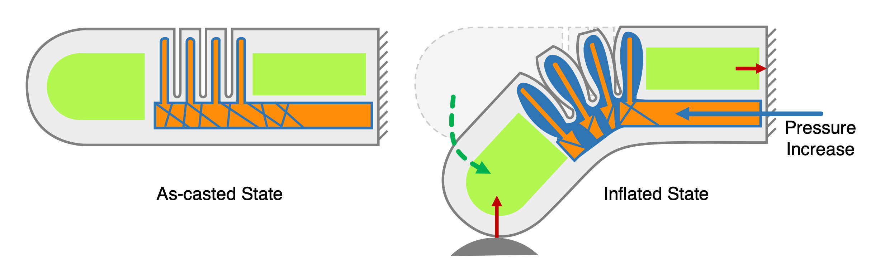
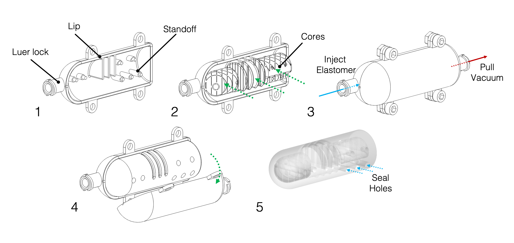
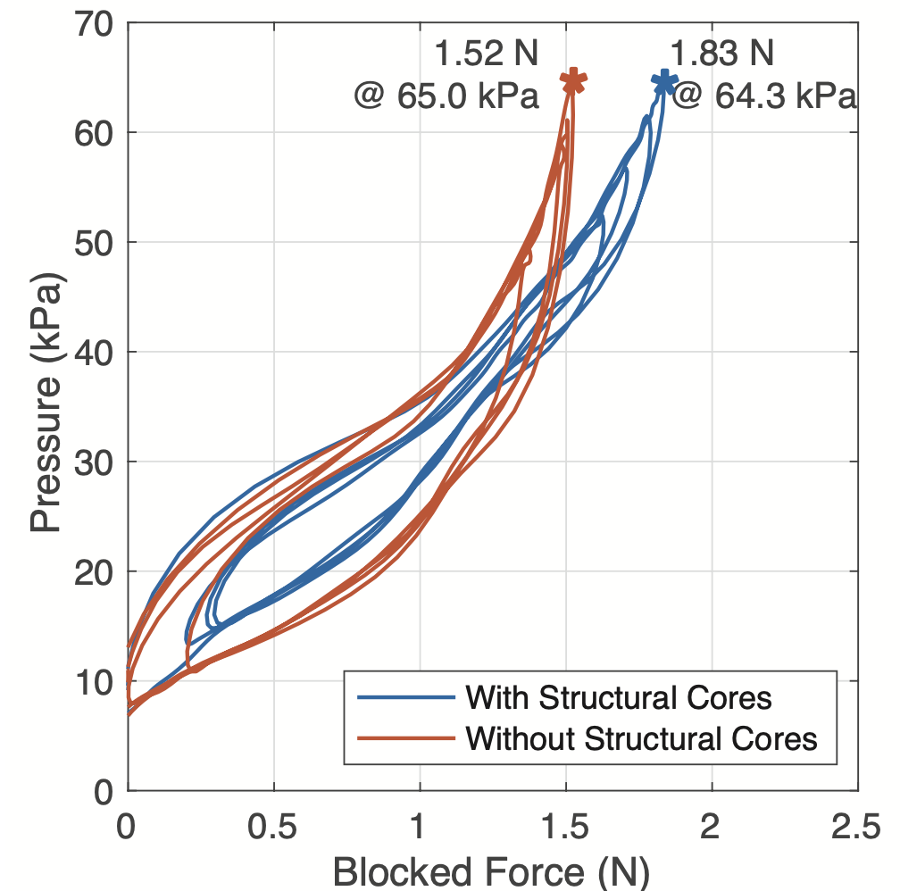

<!--  -->

# Example: Soft Robotic Finger
{: .no_toc }
This is an introductory example of combining structural and negshell cores into a soft robotic actuator. The finger utilizes negshell cores to create a fluid channel that leads up to a series of expanding bellows. Structural cores provide a stiff path for force transmission from the fingertip, through the bellows and up to the base of the finger. The finger is approximately 18 mm in diameter and 55 mm long with a domed tip.

## Table of contents
{: .no_toc .text-delta }

1. TOC
{:toc}

## Design Concepts
<model-viewer src="files/visuals/Finger.glb"
    alt="Finger"
    shadow-intensity="1"
    camera-orbit="-90deg 60deg 0.07m"
    camera-target="0m 0m 0m"
    auto-rotate
    camera-controls
    stage-lighting="0"
    style="width:67%; height:300px;">
    
Bellow-Jointed Finger Mold and Cores

    <button slot="hotspot-lip" data-position="0.000495m 0.00677m 0.032m" data-normal="-1 0 0">
        
Lip

    </button>
    <button slot="hotspot-port" data-position="-0.0165m -0.008m 0.0408m" data-normal="-0.25 1 0">
        
Injection Port

    </button>
    <button slot="hotspot-standoff" data-position="-0.0188m -0.0097m -0.00646m" data-normal="-0.69 0.42 -0.58">
        
Standoffs

    </button>
</model-viewer>

### Bellows
The bellows exploit the fact that silicone rubber does not adhere to most materials, including 3D printed resin. The negshell cores create a series of thin walls that lets fluid travel through the channel and around the walls to expand the surrounding silicone rubber.

### Mold
The mold halves have three features that aid in the casting process:
1. A lip that helps align the two mold halves together when closed and provide a weak seal to prevent silicone rubber from escaping. For areas that are prone to small air bubbles forming, the weak seal can let out small amounts of air escape.
1. Standoffs for the cores that are simply ⌀2.5 mm columns that reach from the mold halves' interior up to the core. The columns interface with the core also conforms to the core's shape. At the end of the column, a ⌀1.5 mm peg that matches with the corresponding holes in the cores aligns the cores upon insertion. Standoffs from each side of the mold help lock the cores down into place.
1. Luer lock injection ports provide a convenient way to inject liquid silicone rubber using a syringe. A minimum of two ports is required, the additional ports are used for venting air or pulling a vacuum using another syringe.

## Printing

Use the following guidelines for printing the mold and cores - adapt them to your printer's slicer:
1. Orient the molds so that the internal surface has the least amount of supports. Since the molds are thin and light, a support density of 0.7 is enogh.
1. Orient the structural cores such that the 1.5 mm alignment holes are facing away from the bed - this helps resin escape during printing.
1. Orient the negshell core such that the bellows require the least amount of supports. Orienting the bellow fins perpendicular to the bed with the fluid channels parallel to the bed is usually a good starting point.
1. Use a raft (Full Raft in Preform) as the bases for the negshell core. Use a support density of 0.6 and a touchpoint size of 0.4 mm.

Further guidelines are available in the Printing sections for the [Negshell Cores](negshell-cores#printing) and [Structural Cores](structural-cores#printing).

## Fabrication

1. Prepare the mold by applying a thin layer of [mold release](molding-and-casting#release-agents).
1. Insert the cores into one of the mold halves.
1. Close the mold and clamp the halves shut using M3 bolts and nuts. Then inject 20 grams of [Plat-Sil Gel 25](molding-and-casting#platinum-cure-silicone). Use the vent port with another syringe if needed to help pull a vacuum, otherwise fill the mold until the silicone oozes out.
1. After 1 hour, remove the mold halves. Waiting for an additional 15 minutes to 1 hour allows the silicone rubber to further strengthen in order to reduce risks of tearing during demolding.
1. The standoffs will create holes. Use [Sil-Poxy](molding-and-casting#silicone-adhesives) to seal the holes. Then break the fluid channel part of the negshell core and remove it from the part. Finally, attach a 4 mm diameter silicone tube using Sil-Poxy to the fluid channel.

## Testing
We tested the finger's force output by securing the finger to a base and actuating it using a syringe to push against a load cell. We compared two fingers: one without structural cores and one with structural cores.

<video src="images/fingerPushing.mp4" width="540" height="300" autoplay loop controls preload></video>

The results show that the finger with structural cores was able to apply 20% more force compared to the finger without the structural cores.

