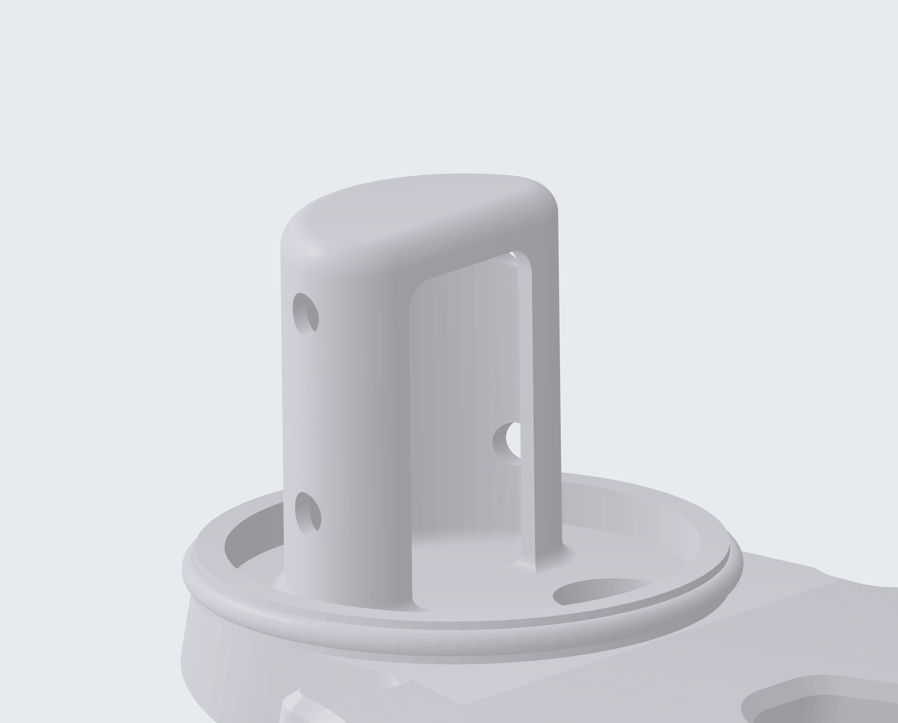
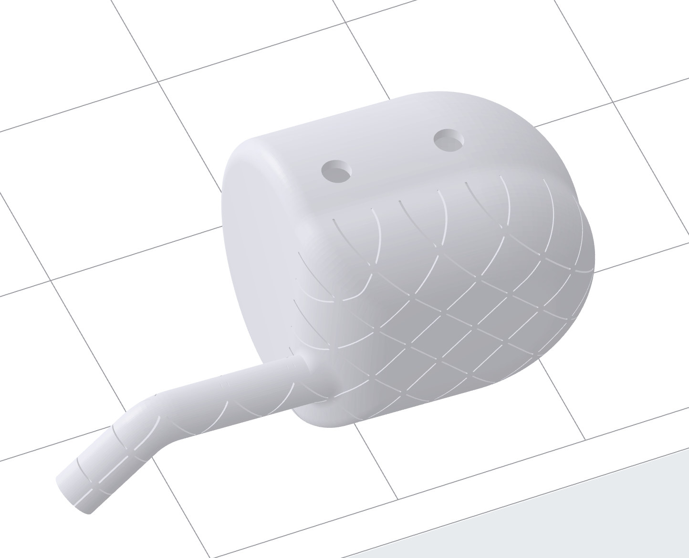
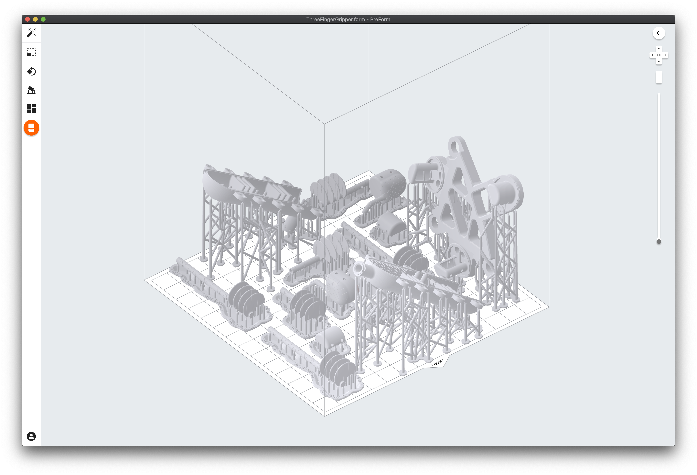

# Example: Soft Robotic Gripper
{: .no_toc }

## Table of contents
{: .no_toc .text-delta }

1. TOC
{:toc}

## Design
<model-viewer src="files/visuals/GripperFingerV2.glb"
    alt="Finger"
    shadow-intensity="1"
    camera-orbit="-90deg 60deg 0.1m"
    stage-lighting="0"
    auto-rotate
    camera-controls
    style="width:67%; height:300px;">
    
Gripper Finger Mold and Cores

</model-viewer>
<model-viewer src="files/visuals/GripperFabrication.glb"
    alt="Finger"
    shadow-intensity="1"
    camera-orbit="-90deg 60deg 0.2m"
    stage-lighting="0"
    auto-rotate
    camera-controls
    style="width:67%; height:300px;">
    
Gripper Fingers and Base

</model-viewer>
### Fingers
The fingers are similar to those shown in the [Finger Example](example-finger) but with two joints instead of just one. Each joint has its own set of bellows that can be individually actuated with fluid pressure and is created by corresponding negshell cores that link the bellows to a fluid channel that reaches the base.

### Base & Retention Features
The fingers are not held on to the base with adhesives, they are instead mechanically interlocked using a structure similar to a structural core. The interlock is created by an overhang that "traps" the silicone rubber onto the base, as shown below.

### Fingertips
The fingertips have hybrid negshell and structural cores. The "pulp" of the fingertip or fingerpad, is created with a negshell core that is attached to a structural core to create a solid backing. We intend to use this fingertip fo sensing in future research. There are also fluidic channels that reach into the chamber created by the negshell fingerpad. This also makes the fingertips softer and thus more compliant, useful for grasping fragile objects.

## Printing

All parts for the gripper can be printed in a single build plate on the Form 2 and Form 3 printers. Adopt the same guidelines for printing as the [Finger Example](example-finger#printing).

## Fabrication
The fabrication steps in general are the same as the [Finger Example](example-finger#fabrication), with the exception that this is technically a three-part mold instead of a two-part mold. After casting, the negshell fluid channels should be broken and pulled out and removed by either near the base or the entire length.

## Actuation Demonstration
Here, we individually actuate each joint using a hand-driven syringe.

<video src="images/FingerActuation.mp4" width="540" height="300" controls preload></video>

## Pick and Place Demonstration
The base is actually designed to be mounted on a [Barrett WAM Arm](//advanced.barrett.com/wam-arm-1) tool plate. We performed a simple pick-and-place demonstration of various objects to show the negshell casted gripper in use:

<video src="images/PickAndPlace.mp4" width="540" height="300" controls preload></video>
