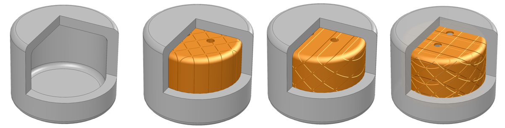
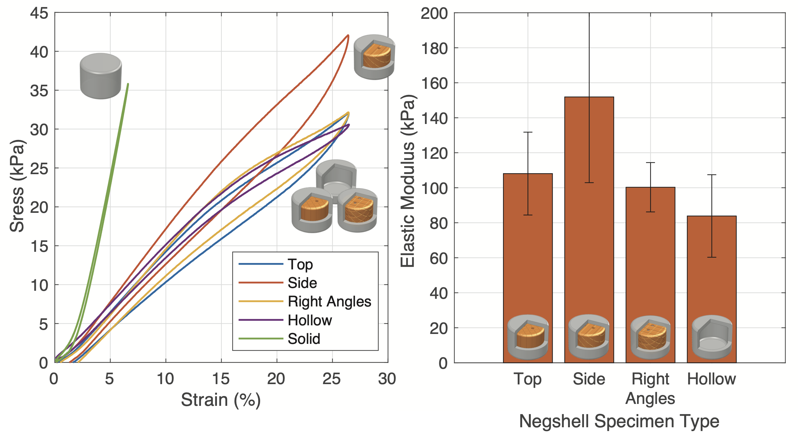

# Negshell Cores
{: .no_toc }

Typical [cores](molding-and-casting#cores) during molding and casting need to be removed after casting. This is fine for solid structures that are orders of magnitude more stronger than their cores such as sand-based cores for metal casting. For weaker materials, such as those used in soft robotics, wax or other dissolvable cores can be used. The problem with wax or dissolvable cores is that they often do not have the geometric stability and accuracy afforded by their respective fabrication methods. For example, wax is very fragile and prone to breaking, and has significant shrinkage.

For soft robots, the cores are essential to make the internal features such as fluid channels, expanding bellows and sensor structures. Cores that have to be removed later greatly reduces the design flexibility and increase the amount of steps required to fabricate soft robots. Our **negshell cores** introduce a new type of core that does not need to be removed in any step of the fabrication process!

Negshell cores are sacrificial, internal, eggshell-type cores (negative eggshells → negshell) that are simply crushed by hand after being casted around. Negshell cores are simply thin-walled (0.4 mm) closed shapes with tiny perforations that span the surface of the core that create a grid of weak points for them to break into small pieces. This means that the cores can be simply left inside the soft robot - cutting down the repeated process of casting in multiple times on the same part while expanding the design possibilities for soft robots.

Note that negshell cores need not be closed volumes, they can be thin walls that become the internal voids of a bellow, as shown in the [Finger](example-finger) example or other structures that require a collapsible internal feature.

## Table of contents
{: .no_toc .text-delta }

1. TOC
{:toc}

## Characteristics
Breaking the negshell cores after casting requires little effort by pinching and crushing by hand.

<video src="images/crushSquish.mp4" width="541" height="300" autoplay loop controls preload></video>

Silicone-based structures with broken negshell cores behave similarly in compression to structures without any cores. We go over the characterization in the paper. The results can be summarized in the following stress-strain curve plot and resulting elastic modulus.

## Designing
Creating negshell cores in CAD is a straightforward process and can be adapted to many different CAD software pipelines.

(*SW* denotes steps that are for SolidWorks, however all the following steps can be adapted to other software.)

1. Starting with a solid geometry of the desired core, create a thin surface that is thickened towards the inside core. We found that a thickness of 0.4 mm is ideal since it is the thinnest wall that the Formlabs Form 2 can print.
    1. *SW* - It is advisable to add fillets so the core has tangent continuity across the whole surface.
    1. *SW* - Use the **Surface Offset** command and set the **Offset to 0 mm** to create a copy of the surface.
    1. *SW* - Use the **Thicken** command to thicken the surface by **0.4 mm** inwards (right most button of the three options). Make sure to **untick Merge Result**. Then hide the original solid body. *This thickness can be tweaked and tuned for different printers or materials.*
1. Cut perforations into the core using this pattern:
    1. *SW* - Create a sketch in the desired plane and use [this](downloads) pattern by going to **Tools → Blocks → Insert**. Position and insert multiple blocks to cover the desired area. *This perforation pattern can be tweaked and tuned for different printers or materials.*
    1. *SW* - Use the **Cut-Extrude** command to cut the perforations into the parts. Use the **Through All - Both** option to ensure the whole part is cut.
    1. *SW* - Repeat the above steps for cutting perforations in multiple directions. Generally one direction suffices.
    1. *SW* - (Optional) Sometimes the perforations result in multiple bodies - keep all the bodies. Put the core bodies in a folder for easier handling.
1. Add mounting features to the core. The core cannot simply hover in place in the mold without any support. All the cores used in our paper and this website have 1.5 mm holes that a 1.5 mm column from the mold would slide into to suspend the cores in place.
    1. *SW* - Use the **Cut-Extrude** command to cut the 1.5 mm holes.
1. Export the files for printing.
    1. *SW* - Hide all the bodies except for the negshell cores and go to **File → Save As...** and select the .STL format or best format for your SLA/DLP printer.

More advanced users of SolidWorks should design the cores and molds together in a single part with multiple bodies so design changes can propagate throughout the mold and cores at once.

For examples of using a negshell cores in oft robotic designs, see the Finger and Gripper examples.

## Printing
3D printing negshell cores has only been tested on a Formlabs Form 2 and a Formlabs Form 3 printer. In theory, any SLA or DLP printer should work, so perform tests with small samples to find the right parameters for your printer. This workflow is also mainly for Formlab's Preform software, although it can also be adapted to other printers. We also provide readily printable .preform files in the [Downloads](/downloads#simple-design-examples) section. We used Formlabs Clear V4 resin.

1. Import the .STL for the cores. Generally, Preform will use the Autodesk Netfabb cloud service to repair any broken models. If this occurs, double check the model for inconsistencies.
1. Orient the part so that there are minimal support structures. The Form 3 has easily removable supports, but the Form 2 has harder to break supports. Removing supports without care may end of breaking the cores prematurely.
1. Generate the supports with the following parameters: **Density: 0.6**, **Touchpoint Size: 0.4 mm**, **Raft: On**.
    1. Using a raft will help with support removal, as it is easier to hold the part in one hand and trim supports with the other.
    1. If there are too many support structures compared to typical parts, even if the density is low, do the following:
        1. *SW* - Right click on the perforation's **Cut-Extrude** feature and **Suppress** it.
        1. Re-export the now solid-walled core.
        1. Import the solid-walled core, orient it and then generate supports with the above parameters.
        1. Right click on the part and click **Replace...**. Replace the part with your negshell core. The supports will be regenerated, but only around the existing supports. Ignore any errors about printability on the negshell core.
1. Print the part(s). The negshell perforations and mounting holes will provide an escape for resin that is trapped during the printing process.
1. After printing, remove the parts using the raft and trim away the supports carefully. Use a paper towel doused in 95% or higher IPA to wipe the cores clean. We advise against submerging the parts in IPA due to absorption that can lead to cracks in the thin walls.
