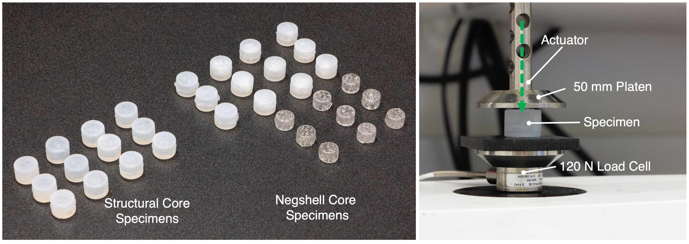

# Specimens for Mechanical Testing
{: .no_toc }

## Table of contents
{: .no_toc .text-delta }

1. TOC
{:toc}

## Design
To characterize how negshell and structural cores change the stiffness of silicone rubber, we used ⌀16 mm x 11 mm hollow cylinder cores that are casted in a mold, creating a cylindrical specimens ⌀20 mm x 15 mm in size.
<model-viewer src="files/visuals/PerfBoth.glb"
    alt="Negshell Core"
    shadow-intensity="1"
    camera-orbit="45deg 75deg 0.03m"
    stage-lighting="0"
    auto-rotate
    camera-controls
    style="width:67%; height:150px;">
    
⌀16 mm x 11 mm Negshell Core

</model-viewer>
<model-viewer src="files/visuals/SpecimenMold.glb"
    alt="Mold for Specimens"
    shadow-intensity="1"
    camera-orbit="45deg 75deg 0.08m"
    camera-target="0m 0.01m 0m"
    stage-lighting="0"
    auto-rotate
    camera-controls
    style="width:67%; height:300px;">
    
⌀20 mm x 15 mm Specimen Mold

</model-viewer>

## Experimental Setup
We placed the cores under compression using a TA Instruments Electoforce 3200 Mechanical Tester. The specimens are first preloaded slightly and then compressed cyclicly. Further details about characterization are in the paper.

### Video: Negshell Core Under Testing
<video src="images/negshellTrimmed.mp4" width="540" height="300" autoplay loop controls preload></video>

### Video: Structural Core Under Testing
<video src="images/structuralTrimmed.mp4" width="540" height="300" autoplay loop controls preload></video>
*Note: The testing shown is a mock trial for recording purposes, the specimen was incorrectly preloaded.*
